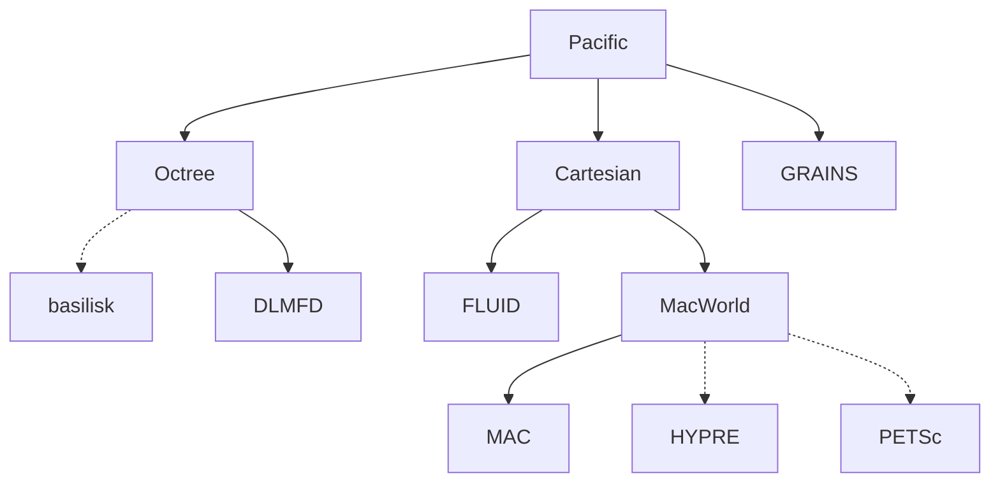

# Welcome to Pacific!

Pacific is a high-performance c/c++ software to simulate multiscale behavior of particle-laden flows. It is composed of Grains3D - a Descrete Element Method  (DEM) solver - as well as a Cartesian CFD solver. It is also linked to the octree-adaptative grid CFD solver Basilisk, for which we provide additional features.




## I. Installation
There is a few steps that need to be done before you can enjoy a functional installation of Pacific. Just follow the guide!

### 1. Provide paths for your libraries in the environment file
```
cp Env/PacIFiC_env_template.env.sh Env/PacIFiC-temporary-env-file.env.sh
```

Modify the file `Env/PacIFiC-temporary-env-file.env.sh` by replacing every part in between the `#`. Then, type the following:

```
cd Env
source PacIFiC-temporary-env-file.env.sh
mv PacIFiC-temporary-env-file.env.sh PacIFiC-${PACIFIC_MPI_DISTRIB}-${PACIFIC_MPI_VERSION}-${PACIFIC_SERCOMPIL_ENV}-${PACIFIC_SERCOMPIL_VERSION}.env.sh
cp ${PACIFIC_HOME}/GRAINS/Env/grains_env_template.env.sh ${PACIFIC_HOME}/GRAINS/Env/grains-${PACIFIC_MPI_DISTRIB}-${PACIFIC_MPI_VERSION}-${PACIFIC_SERCOMPIL_ENV}-${PACIFIC_SERCOMPIL_VERSION}.env.sh
cp ${PACIFIC_HOME}/Cartesian/MacWorld/Env/macworld_env_template.env.sh ${PACIFIC_HOME}/Cartesian/MacWorld/Env/macworld-${PACIFIC_MPI_DISTRIB}-${PACIFIC_MPI_VERSION}-${PACIFIC_SERCOMPIL_ENV}-${PACIFIC_SERCOMPIL_VERSION}.env.sh
cp ${PACIFIC_HOME}/Cartesian/FLUID/Env/fluid_env_template.env.sh ${PACIFIC_HOME}/Cartesian/FLUID/Env/fluid-${PACIFIC_MPI_DISTRIB}-${PACIFIC_MPI_VERSION}-${PACIFIC_SERCOMPIL_ENV}-${PACIFIC_SERCOMPIL_VERSION}.env.sh
source PacIFiC-${PACIFIC_MPI_DISTRIB}-${PACIFIC_MPI_VERSION}-${PACIFIC_SERCOMPIL_ENV}-${PACIFIC_SERCOMPIL_VERSION}.env.sh
```

### 2. Install HYPRE and PETSc
HYPRE and PETSc are high-performace libraries that offer a wide range of state-of-the-art tools for linear algebra and multigrid solvers. In Pacific, we suggest you get HYPRE 2.10.1 and PETSc 3.2.0.

To install HYPRE 2.10.1, copy and paste the following:
```
cd $MACWORLD_ROOT
wget https://computing.llnl.gov/projects/hypre-scalable-linear-solvers-multigrid-methods/download/hypre-2.10.1.tar.gz
tar -zxvf hypre-2.10.1.tar.gz
cd hypre-2.10.1/src
./configure
make install
```

Now, to install PETSc 3.2.0, copy and paste the following:
```
cd $MACWORLD_ROOT
wget http://ftp.mcs.anl.gov/pub/petsc/release-snapshots/petsc-3.2-p7.tar.gz
tar -zxvf petsc-3.2-p7.tar.gz
mv petsc-3.2-p7 petsc-3.2.0-p7
cd petsc-3.2.0-p7
./configure
```
The bulding command for PETSc is being provided by the output of the `./configure`, it should look like: 
```
Configure stage complete. Now build PETSc libraries with (cmake build):
    make PETSC_DIR=[your path to PETSc] PETSC_ARCH=arch-linux2-c-debug all
```
   
Follow the instruction: copy and paste the second line. After this is completed, copy and paste the test to make sure the installation was successful:

```
make PETSC_DIR=[your path to PETSc] PETSC_ARCH=arch-linux2-c-debug test
```

If no error arises, you just installed the two state-of-the-art libraries for high-performance linear algebra manipulations! Just remove the compressed files:
```
cd $MACWORLD_ROOT
rm hypre-2.10.1.tar.gz petsc-3.2-p7.tar.gz
```


### 3. Install Basilisk
Now, let's install the last dependancy: Basilisk, a high-performance multiphase CFD solver on adaptive grids.
All the instructions are extensively explained [here](https://basilisk.fr/install), but here is a summary of what you should do:

```
cd $BASILISK
[to be completed]
```


### 4. Build everything!
* To build the DEM solver Grains3D, assuming you do not already have Xerces 2.8.0, type:
```
cd $GRAINS_HOME
tar zxvf xerces-2-8-0.tar.gz
cd XERCES-2.8.0
./install.sh
cd ../
makeARCH delete
makeARCH create
make install
```

* To build the Cartesian solver, type:
```
cd $MACWORLD_ROOT/MAC
[to be completed]
```


## II. Usage
To be completed soon.
